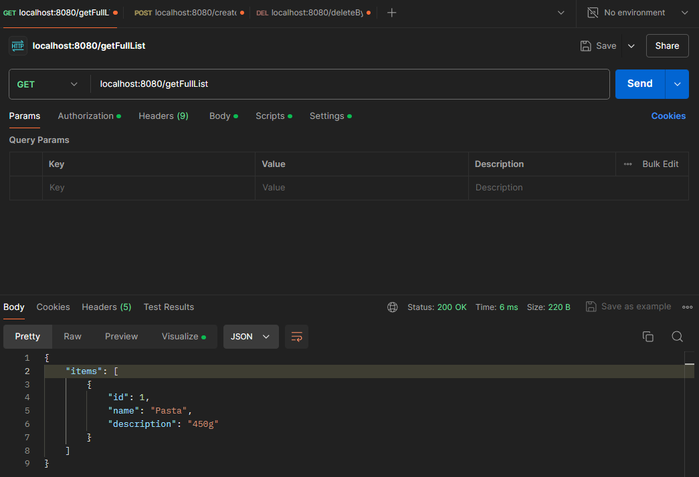
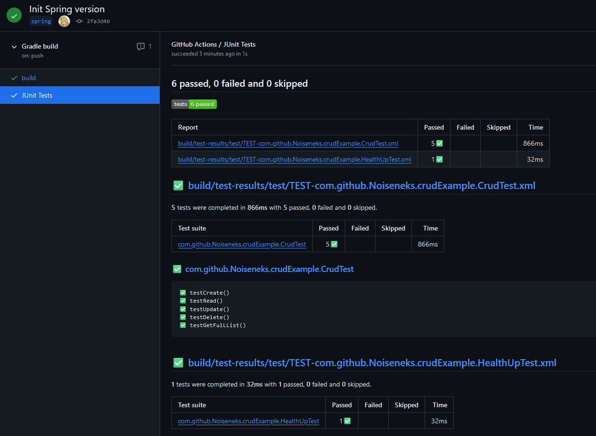

# CRUD-example

Example Spring application, which allows you to Create, Read, Update and Delete items in shopping list

Illustration of app when launched from Intellij IDEA:

## Usage

### How to build

Using Java 17 and Gradle: `./gradlew bootJar`

### How to run

Using java 17 or older:

```shell
java -jar build/libs/CRUD-example-1.0-SNAPSHOT.jar
```

### How to use

You can access the application's functionality using Postman. Default address is `localhost:8080`


## Tests

The application has some simple tests written, and the repository has Github Actions configured to run them
and provide details about their results.
