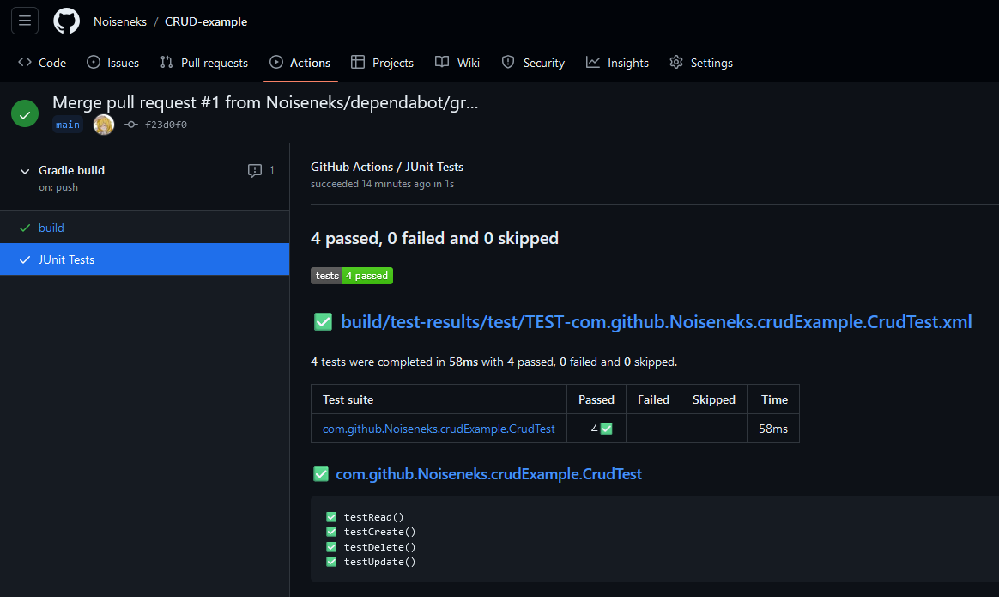

# CRUD-example
Example console application, which allows you to Create, Read, Update and Delete items in shopping list

Illustration of app when launched from Intellij IDEA:


## Using
### How to build
Using Java 17 and Gradle: `./gradlew shadowJar`

### How to run
Using java 17 or older:
```shell
java -jar build/libs/app.jar 
```

## Tests
The application has some simple tests written, and the repository has Github Actions configured to run them 
and provide details about their results.
